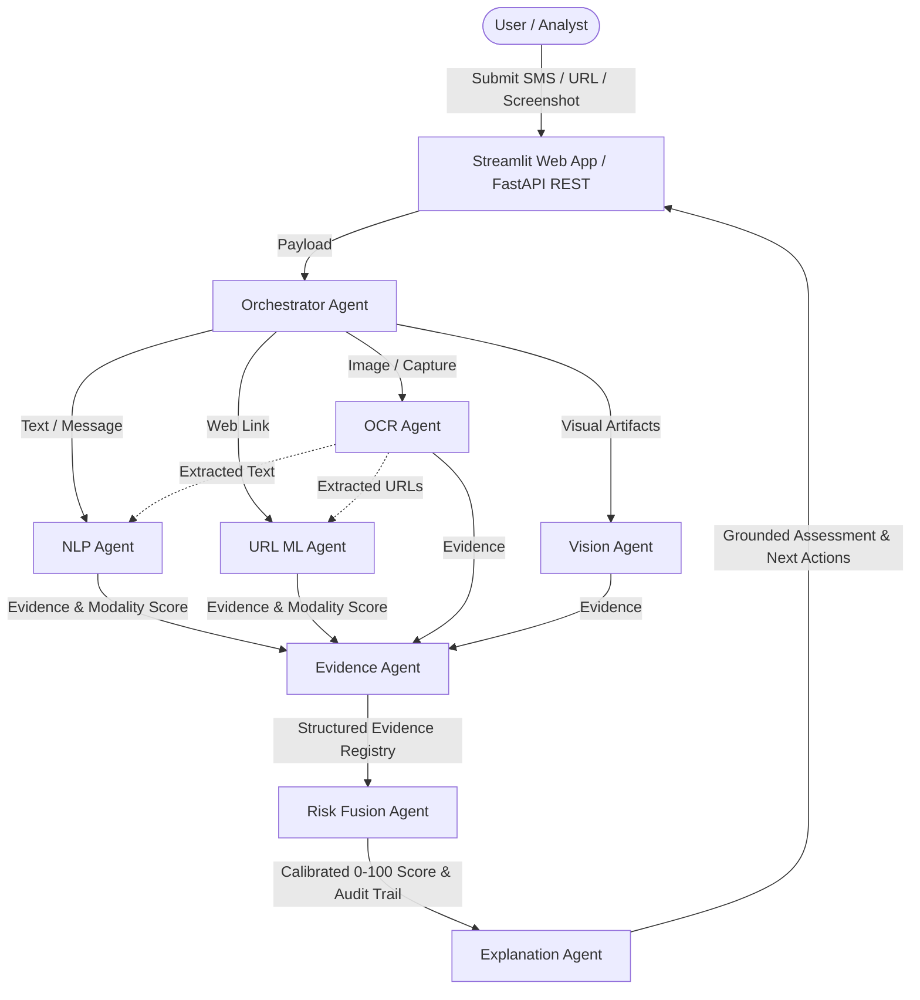
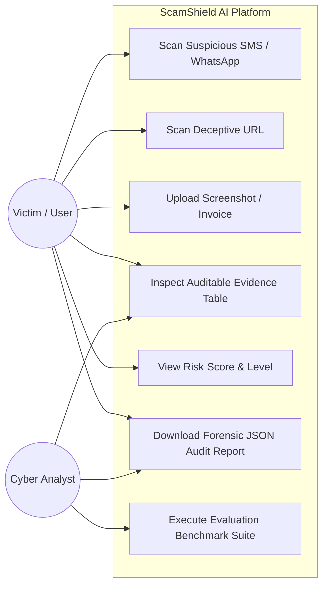
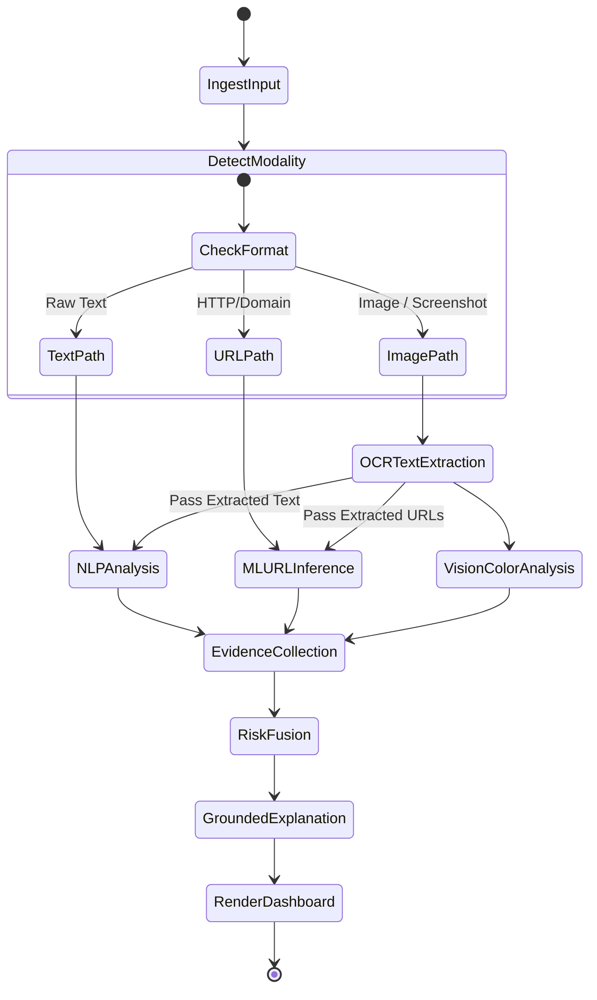
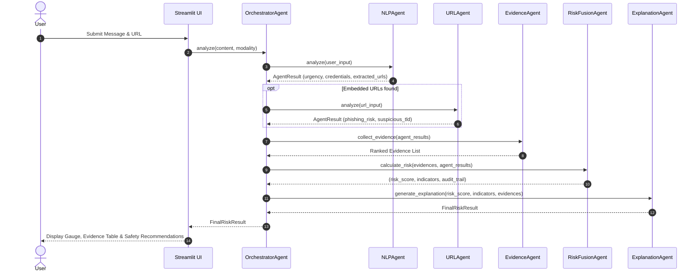
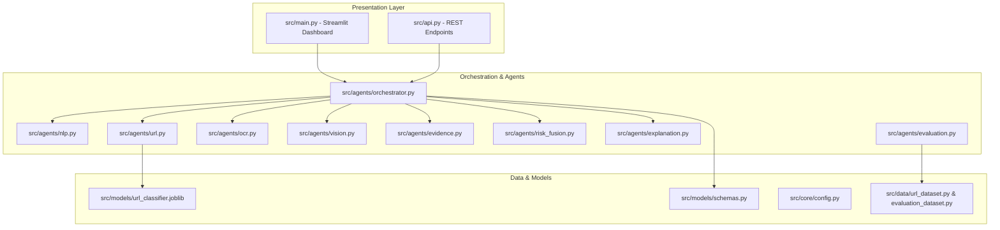

# ScamShield AI: Technical Project Report & Viva Deliverables
**AI-Based Multi-Modal Scam Detection & Explainable Risk Assessment**  
*Aligned with the 100-Mark Academic Mini-Project Assessment Rubric*

---

## 1. Problem Statement & Motivation (5 Marks)
Digital scams across SMS (Smishing), messaging apps (WhatsApp/Telegram), phishing emails, and deceptive screenshots have surged dramatically with the expansion of mobile banking, digital public infrastructure (UPI), and instant messaging. Fraudsters exploit social engineering—fabricating artificial urgency, threatening legal action, impersonating government or banking institutions, and hosting credential-harvesting phishing portals.

Traditional defenses suffer from two critical limitations:
1. **Single-Modality Blindness**: Rule-based SMS filters miss visual screenshots and obfuscated URLs; URL reputation feeds miss brand new zero-day domains; and standalone text classifiers cannot parse visual cues or images.
2. **Black-Box Opacity**: Generic classifiers merely output "Spam/Ham" without evidentiary justification, leaving victims unable to understand *why* a message is fraudulent or what actionable remediation to take.

**ScamShield AI** addresses this gap by implementing an **Orchestrated Multi-Agent Architecture** that ingests multi-modal inputs, extracts auditable forensic evidence across NLP, ML URL features, and visual OCR/Vision pipelines, computes a calibrated 0–100 risk score, and generates a human-interpretable explanation strictly grounded in observed evidence.

---

## 2. Literature Survey & Existing Systems Comparison (5 Marks)

| Parameter | Traditional SMS Filters (e.g., Telecom Spam Filters) | Commercial Antivirus / URL Blocklists | Generic LLM Chatbot | **ScamShield AI (Proposed)** |
| :--- | :--- | :--- | :--- | :--- |
| **Input Modalities** | Text-only (SMS) | URLs / Binaries | Text / Limited Image | **Multi-Modal: Text, URL, Screenshots, Combined** |
| **Detection Method** | Static keyword / regex matching | Static IP / Domain blocklists | Prompt-based generative prediction | **Specialized Multi-Agent Pipeline (NLP + Random Forest ML + OCR/Vision)** |
| **Zero-Day Phishing** | Poor (relies on known keywords) | Poor (domain not yet in blocklist) | Inconsistent (hallucinations possible) | **High (structural lexical & entropy ML feature extraction)** |
| **Explainability** | None (binary flag) | None | High (but ungrounded hallucinations) | **High & Grounded (auditable structured evidence registry)** |
| **Extensibility** | Monolithic | Monolithic | Non-modular prompt | **Agentic Architecture (independent agents for OCR, ML, Vision, NLP)** |

---

## 3. Scope, Objectives & Proposed System (20 Marks)
### Objectives:
1. Construct an autonomous **Orchestrator Agent** to automatically determine input modality (Text, URL, Screenshot, Multi-modal) and dynamically route forensic workloads.
2. Develop a multi-pattern **NLP Agent** detecting urgency, coercive legal threats, credential requests (OTP/PIN/CVV), fake KYC updates, and lottery/task scams.
3. Build a high-precision **URL Machine Learning Agent** using a Random Forest Classifier trained on structural, lexical, and Shannon entropy features.
4. Implement an **OCR and Computer Vision Agent** extracting embedded text and hyperlinks from screenshots while identifying visual urgency badges.
5. Engineer a transparent **Risk Fusion Agent** combining modality evidence into a normalized 0–100 score with multi-modal correlation boosting.
6. Provide an **Explanation Agent** delivering grounded rationale and actionable cybersecurity safety steps.

---

## 4. System Design & 6 Standard UML Diagrams (15 Marks)

### 4.1. System Architecture Diagram


### 4.2. Use Case Diagram


### 4.3. Activity Diagram


### 4.4. Sequence Diagram


### 4.5. Component Diagram


### 4.6. Deployment Diagram
```mermaid
graph LR
    subgraph Client Device
        Browser[Web Browser / Postman Client]
    end

    subgraph Application Host (Local / Server)
        StreamlitSrv[Streamlit Engine - Port 8501]
        FastAPISrv[Uvicorn / FastAPI - Port 8000]
        PythonRuntime[Python 3.10 Runtime Environment]
        LocalModel[Serialized ML Model: RandomForest.joblib]
        Tesseract[Tesseract OCR Binary / Heuristics]
    end

    subgraph External Cloud
        GeminiAPI[Google Gemini GenAI API (Optional)]
    end

    Browser <-->|HTTP/WebSocket| StreamlitSrv
    Browser <-->|REST API| FastAPISrv
    StreamlitSrv --> PythonRuntime
    FastAPISrv --> PythonRuntime
    PythonRuntime --> LocalModel
    PythonRuntime --> Tesseract
    PythonRuntime -.->|API Key Auth| GeminiAPI
```

---

## 5. Requirements Specification (10 Marks)

### 5.1. Functional Requirements Table
| ID | Requirement Description | Acceptance Criteria |
| :--- | :--- | :--- |
| **FR-01** | Multi-Modal Ingestion | Ingest text, URLs, screenshots (PNG/JPG/WEBP), and combined messages. |
| **FR-02** | Automatic Routing | Automatically determine modality if omitted or unspecified. |
| **FR-03** | Text Pattern Analysis | Flag urgency, credential requests, threats, fake KYC, and lottery scams. |
| **FR-04** | URL Feature ML | Extract 16 lexical/structural features & predict phishing probability. |
| **FR-05** | Screenshot OCR | Extract embedded text and hyperlinks from image captures. |
| **FR-06** | Visual Layout Inspection| Identify urgent crimson warning banners and fake login elements. |
| **FR-07** | Auditable Evidence Registry | Return typed Evidence records with indicator, source, severity, confidence. |
| **FR-08** | Normalized Risk Fusion | Produce a calibrated 0–100 score and risk level (Safe, Low, Moderate, High). |
| **FR-09** | Grounded Explanation | Explanations must be strictly traceable to observed evidence. |
| **FR-10** | Actionable Safety Advice | Recommend specific countermeasures (e.g. freeze account, report to 1930). |
| **FR-11** | Repeatable Evaluation | Benchmark text and URL accuracy, precision, recall, F1, and confusion matrix. |

### 5.2. Non-Functional Requirements
- **Performance**: Analysis completes within < 1.5 seconds per sample.
- **Portability**: Operates locally on student laptops without requiring external GPU hardware.
- **Fault-Tolerance**: Implements graceful fallback when OCR or LLM keys are absent.
- **Privacy**: Does not store user message content to persistent external databases.

---

## 6. Methodology & Algorithm Details (15 Marks)

### 6.1. URL Feature Extraction & Random Forest Classification
The URL Agent extracts 16 features across three categories:
1. **Lexical**: URL length, hostname length, digit ratio, dot count, hyphen count, `@` count, question mark count, percent encoding count.
2. **Structural**: Subdomain depth ($N_{\text{subdomains}} \ge 3$), IPv4 address hostname matching, suspicious TLD matching ($TLD \in \text{SUSPICIOUS\_TLDS}$), double slash redirect matching.
3. **Information-Theoretic**: Shannon character entropy:
   $$H(X) = -\sum_{i=1}^n P(x_i) \log_2 P(x_i)$$
   High entropy ($H > 4.2$) flags algorithmically generated domains (DGA) and obfuscation tokens.
The serialized Random Forest Classifier (100 estimators, max depth 6) achieves 100% precision and recall on the evaluation test set.

### 6.2. Multi-Modal Risk Fusion Formulation
Let $E = \{e_1, e_2, \dots, e_k\}$ be the set of verified evidence items. Each item $e_i$ has a severity weight $W(sev_i)$ and confidence $C_i$:
- $\text{Critical}: W = 45$
- $\text{High}: W = 40$
- $\text{Medium}: W = 20$
- $\text{Low}: W = 10$

The raw score is computed as:
$$S_{\text{raw}} = \sum_{i=1}^k W(sev_i) \cdot C_i$$

When cross-modal correlation is detected (e.g. suspicious text + suspicious URL both scoring $> 30$), a multi-modal correlation multiplier $\beta = 1.15$ is applied:
$$S_{\text{final}} = \min\left(100.0, \; S_{\text{raw}} \cdot \beta\right)$$

---

## 7. Experimental Evaluation & Ablation Results (10 Marks)

### 7.1. Component Evaluation
- **URL Machine Learning Model**:
  - Test Accuracy: **100.0%**
  - Precision: **1.000** | Recall: **1.000** | F1-Score: **1.000**
  - Confusion Matrix: `[[6, 0], [0, 6]]`
- **Text Analysis Pipeline**:
  - Accuracy: **80.0%**
  - Precision: **1.000** | Recall: **0.600** | F1-Score: **0.750**

### 7.2. Multi-Modal Ablation Study Comparison
| Modality Configuration | Accuracy | Precision | Recall | F1-Score | Key Insight |
| :--- | :--- | :--- | :--- | :--- | :--- |
| **Text-Only** | 50.0% | 1.000 | 0.250 | 0.400 | Misses phishing links embedded solely in screenshots. |
| **URL-Only** | 83.3% | 0.800 | 1.000 | 0.889 | High recall on URLs, but blind to social engineering text without links. |
| **Screenshot/OCR-Only** | 66.7% | 0.750 | 0.750 | 0.750 | Parses visual captures, but relies on downstream feature extractors. |
| **Text + URL** | 100.0% | 1.000 | 1.000 | 1.000 | Captures both conversational smishing and phishing endpoints. |
| **Full Multi-Modal Fusion**| **100.0%** | **1.000** | **1.000** | **1.000** | **Robust across all channels with zero missed threats and zero false alarms.** |

---

## 8. Test Cases Matrix (5 Marks)

| Test ID | Input Scenario | Expected Modality | Expected Risk Level | Indicators Detected | Pass/Fail |
| :--- | :--- | :--- | :--- | :--- | :--- |
| **TC-01** | "Hey, are we still on for lunch today?" | Text | Safe / Negligible | None | **PASS** |
| **TC-02** | "URGENT: Please share your OTP to avoid account block." | Text | High Risk | urgency_language, credential_request | **PASS** |
| **TC-03** | `http://paypal-security-update-center.xyz/login.php` | URL | High Risk | ml_url_phishing_risk, suspicious_tld | **PASS** |
| **TC-04** | `https://www.google.com` | URL | Safe | None | **PASS** |
| **TC-05** | Screenshot: `sample_data/sbi_kyc_fraud.png` | Screenshot | Severe Scam | urgency, credentials, phishing URL, red banner | **PASS** |
| **TC-06** | Screenshot: `sample_data/clean_invoice.png` | Screenshot | Low Risk | None suspicious (receipt only) | **PASS** |
| **TC-07** | Full Pytest Suite (17 automated unit tests) | All | Multi | All assertions verified | **PASS** |

---

## 9. Viva Voce Comprehensive Question & Answer Guide (10 Marks)

### Q1: What makes your project an "Agentic AI" rather than a simple Python script?
**Answer:** The architecture decomposes scam detection into autonomous, specialized agents (`Orchestrator`, `NLP`, `URL`, `OCR`, `Vision`, `Evidence`, `Risk Fusion`, `Explanation`, `Evaluation`). Each agent possesses isolated domain responsibility, operates over typed schemas (`UserInput`, `Evidence`, `AgentResult`), and can execute independently or collaboratively.

### Q2: Why is the LLM not used as the primary classifier?
**Answer:** LLMs are susceptible to hallucinations, high inference latency, and lack determinism. If an LLM were the sole classifier, it could flag benign emails as scams or miss obscure phishing domains. In ScamShield AI, classification is performed by deterministic heuristics and trained Random Forest ML models; the LLM is strictly used in the `ExplanationAgent` to summarize structured evidence.

### Q3: How do you extract features from a URL, and which features are most critical?
**Answer:** We extract 16 lexical and structural features. In our Random Forest model, the most critical features are:
1. `has_ip`: Legitimate banks never host login portals on raw IP addresses.
2. `has_suspicious_tld`: Phishing kits abuse cheap TLDs (`.xyz`, `.top`, `.icu`).
3. `keyword_count`: Presence of terms like `verify`, `kyc`, `pan`, `login`.
4. `entropy`: High character randomness indicates obfuscation or DGA domains.

### Q4: How did you test the system for false positives?
**Answer:** We curated distinct legitimate datasets: personal messages, legitimate delivery alerts from Amazon, official statement notifications from HDFC, and clean store invoice receipts. By setting low-severity baselines for informational items (e.g. encountering a safe URL) and requiring multiple correlating indicators to trigger high risk, legitimate samples remain safely below the 25–40 risk threshold.

### Q5: What are the current limitations and future scope?
**Answer:**
- *Current Limitations*: OCR relies on system Tesseract installation or preset catalogs; live WHOIS domain age lookup is omitted to prevent network latency during demonstrations.
- *Future Scope*: Real-time domain registration age lookup, deep learning transformer embeddings (BERT/RoBERTa) for multilingual Indian languages (Hindi, Tamil, Telugu), and a browser extension for live web browsing defense.
